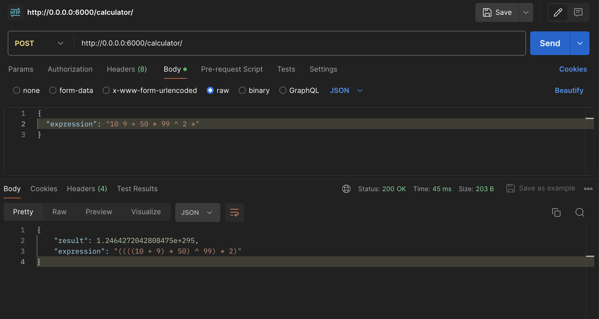
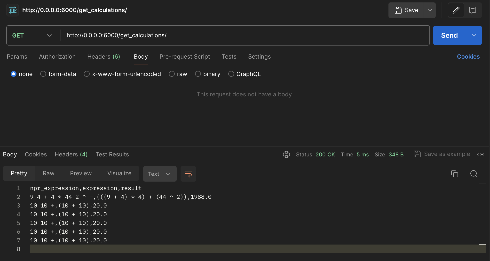

# Reverse Polish Notation (RPN) Calculator API

This project implements a FastAPI-based API for a Reverse Polish Notation (RPN) calculator.

A Reverse Polish Notation (RPN) calculator operates by evaluating mathematical expressions using a stack-based approach. Unlike traditional infix notation where operators are placed between operands (e.g., "3 + 4"), RPN places operators after operands (e.g., "3 4 +"). Evaluation proceeds from left to right: each operand is pushed onto a stack, and when an operator is encountered, the necessary operands are popped from the stack, the operation is performed, and the result is pushed back onto the stack. This process continues until the entire expression is evaluated, leaving the final result on the stack. RPN is known for its efficiency in computation and is widely used in calculators and programming languages for its simplicity and clarity in expression evaluation.

## Features

- **Calculation :** Accepts mathematical expressions in postfix notation and computes the result.
- **Persistence :** Stores each calculation entry in a PostgreSQL database.
- **Data retrieval :** Provides endpoint to retrieve stored calculation entries in CSV format.

## Technologies used

- **Python :** Core programming language.
- **FastAPI :** Web framework for building APIs with Python.
- **PostgreSQL :** Database for storing calculation history.

## Installation

1. **Clone the repository :**

```git clone https://github.com/bilelouahmed/npi-calculator.git```

```cd NPR-Calculator```

2. **Up the Docker containers :**

```docker compose up```

## Usage

Once the Docker containers are up and running, you can query the address 'http://localhost:6000' using one of the following endpoints :

### Calculator endpoint

- **Endpoint :** `/calculator`
- **Method :** POST
- **Request body example :**
```
{
 "expression": "5 3 + 10 *"
}
```
- **Response example :**
```
{
  "result": 8.0,
  "expression": "(5 + 3)"
}
```


### Retrieving calculation history endpoint

- **Endpoint :** /get_calculations
- **Method :** GET
- **Response :** Returns a CSV file with columns npr_expression, expression, result for all stored calculations.


